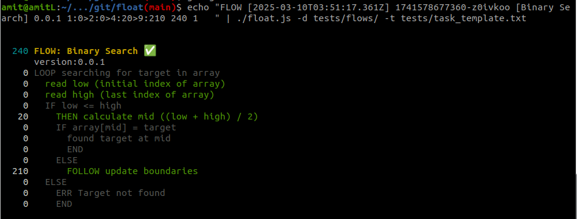

# Float (Flowgger LOgs Analysis Terminal)

Float helps you to analyze and visualize logs written by [Flowgger](https://www.npmjs.com/package/@solothought/flowgger) library.

```
$ npm i -g @solothought/float
```



- first coloum shows the execution time of flow and each step
- All the steps which are not executed are greyed out.
- You must define the template of your log data, path of flow file, and flow log data